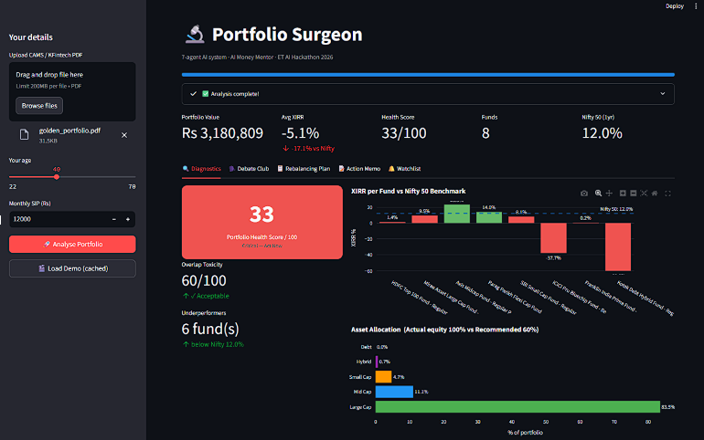

# 🔬 Portfolio Surgeon — AI Money Mentor

<div align="center">

**ET AI Hackathon 2026 · Problem Statement PS9 · MF Portfolio X-Ray**

[](https://python.org)
[](https://github.com/langchain-ai/langgraph)
[](https://console.groq.com)
[](https://streamlit.io)
[](LICENSE)
[](https://console.groq.com)

<br/>

> **Most tools analyse portfolios. Portfolio Surgeon engineers decisions.**

*A 7-agent agentic AI system that transforms a raw CAMS/KFintech PDF into a conviction-scored, tax-aware, execution-ready investment action plan — in under 45 seconds.*

<br/>

<!-- Take a screenshot of the running Streamlit app and save it to docs/screenshot.png -->


---

</div>

## 📋 Table of Contents

- [The Problem We're Solving](#-the-problem-were-solving)
- [What Portfolio Surgeon Does](#-what-portfolio-surgeon-does)
- [The Debate Club — Our Differentiator](#️-the-debate-club--our-differentiator)
- [System Architecture](#️-system-architecture)
- [Agent Pipeline](#-agent-pipeline-deep-dive)
- [QUICK START](#-quick-start)
- [Demo Mode](#-demo-mode)
- [Project Structure](#-project-structure)
- [Tech Stack](#-tech-stack)
- [Impact Model](#-impact-model)
- [Sample Output](#-sample-output)
- [Known Limitations](#-known-limitations)
- [Roadmap](#️-roadmap)
- [Team](#-team)

---

## 😵 The Problem We're Solving

**95% of Indian investors have no structured financial plan.**

A SEBI-registered advisor charges ₹25,000–₹50,000 per year. That makes professional portfolio analysis a luxury accessible only to HNIs — while 14 crore+ demat account holders are flying blind, making decisions based on nothing more than NAV numbers and WhatsApp forwards.

What they actually get from their fund house is a PDF like this:

```
Folio No: 101/A1
Scheme: HDFC Top 100 Fund - Regular Plan - Growth
ISIN: INF179K01BE2

Date        Description     Amount      Units       NAV         Balance
15-Jan-22   SIP Purchase    10,000.00   20.833      480.0000    20.833
15-Feb-22   SIP Purchase    10,000.00   20.619      484.9800    41.452
...
```

Hundreds of rows. No XIRR. No overlap analysis. No benchmark comparison. No rebalancing advice. Just data — with zero decision intelligence layered on top.

**The gap isn't data. It's the missing layer between data and decisions.**

---

## 🧠 What Portfolio Surgeon Does

Upload a CAMS or KFintech PDF. Enter your age and monthly SIP. Get a complete investment intelligence report in 45 seconds.

| What you upload | What you get back |
|---|---|
| Raw CAMS/KFintech PDF | True XIRR per fund, computed from every transaction |
| Fund names in a table | Overlap toxicity score — which funds secretly hold the same stocks |
| Transaction history | Portfolio health score (0–100) with six diagnostic flags |
| Nothing | Bull vs Bear vs Judge debate per fund with conviction score |
| Nothing | Tax-aware rebalancing plan (STCG vs LTCG timing flagged) |
| Nothing | Downloadable action memo ready to hand to your MFD |
| Nothing | Persistent watchlist alerts saved across sessions |

**This is not a dashboard. It is a decision engine.**

---

## ⚔️ The Debate Club — Our Differentiator

Every portfolio analysis tool gives you numbers. Portfolio Surgeon gives you a simulated investment committee.

For each of the top 5 funds by portfolio weight, three specialised AI agents debate the holding:

### 🐂 Bull Agent
Makes the strongest possible case **for holding or increasing allocation**. Grounded in this investor's actual XIRR, portfolio weight, and benchmark performance — not generic market commentary.

```
"Parag Parikh Flexi Cap Fund carries a 29.7% portfolio weight with a compelling
XIRR of 19.5% — significantly outpacing the Nifty 50's 12% one-year return.
Its global diversification into US tech reduces India-specific concentration risk.
The fund's consistent outperformance across 3 and 5 year periods justifies
maintaining and even increasing the current SIP."
```

### 🐻 Bear Agent
Makes the strongest possible case **against the fund — trimming or exiting**. References overlap with other holdings, expense drag, and underperformance with specific numbers.

```
"At 29.7% portfolio weight, Parag Parikh Flexi Cap is a single-fund concentration
risk in a portfolio with an overlap toxicity score of 80/100. Three other large-cap
funds in this portfolio hold identical positions in Reliance and HDFC Bank. The
investor is paying for diversification they are not receiving."
```

### ⚖️ Judge Agent
Synthesises both arguments into a **decisive, conviction-scored verdict in structured JSON**.

```json
{
  "verdict": "TRIM",
  "conviction": 8,
  "reasoning": "Strong XIRR performance argues for retention, but concentration
                risk at 29.7% weight is the dominant risk factor in a portfolio
                already showing 80/100 overlap toxicity.",
  "action": "Reduce allocation by 20-25% via partial redemption. Redirect to
             mid-cap index fund to improve diversification without reducing
             equity exposure."
}
```

The Judge runs at `temperature=0.1` — deterministic, not creative. Bull and Bear run at `temperature=0.3` — argumentative, not hallucinating.

**15 LLM calls. 5 funds. 3 agents each. One investment committee.**

---

## 🏗️ System Architecture

```
┌─────────────────────────────────────────────────────────────────────────┐
│                         PORTFOLIO SURGEON                               │
│                    LangGraph Orchestrated Pipeline                      │
└─────────────────────────────────────────────────────────────────────────┘

User Input
  │  CAMS/KFintech PDF
  │  Age + Monthly SIP
  ▼
┌──────────┐    ┌──────────┐    ┌───────────────┐      ┌─────────────┐
│  Parser  │───▶│ Enricher │───▶│ Diagnostician │───▶│ Debate Club │
│ Agent 1  │    │ Agent 2  │    │   Agent 3     │      │  Agent 4    │
└──────────┘    └──────────┘    └───────────────┘      └─────────────┘
     │               │                 │                     │
  pdfplumber      mfapi.in         6 checks              Groq API
  regex + LLM     pyxirr           health score          Bull+Bear+Judge
  fallback        AMFI fallback    overlap/xirr/         per top-5 funds
                  benchmark        allocation
                                                               │
                                                               ▼
                                                    ┌──────────────────┐
                                                    │   Strategist     │
                                                    │   Agent 5        │
                                                    └──────────────────┘
                                                           │
                                                       Groq API
                                                       Tax-aware plan
                                                       STCG/LTCG timing
                                                           │
                              ┌────────────────────────────┘
                              ▼
              ┌──────────┐    ┌──────────┐
              │ Executor │───▶│ Monitor  │
              │ Agent 6  │    │ Agent 7  │
              └──────────┘    └──────────┘
                   │               │
            Action memo         SQLite
            Plain text         Watchlist
            Download-ready     Persistent alerts
                   │               │
                   └───────┬───────┘
                           ▼
               ┌────────────────────┐
               │   Streamlit UI     │
               │   5-Tab Interface  │
               │                    │
               │ • Diagnostics      │
               │ • Debate Club      │
               │ • Rebalancing Plan │
               │ • Action Memo      │
               │ • Watchlist        │
               └────────────────────┘

External Services (all free):
  Groq API (LLaMA 3.3 70B)     — LLM inference, free tier
  mfapi.in                      — Live NAV history, free
  AMFI NAVAll.txt               — Fallback NAV source, free
  SQLite (local)                — Watchlist persistence, built-in
```

### Design Principles

**Single shared state.** Every agent reads from and writes to one `PortfolioState` TypedDict. The Debate Club can reference XIRR computed by the Enricher without any inter-agent API calls. The Strategist sees every verdict the Debate Club produced. Nothing is re-fetched.

**Fault-tolerant by design.** LangGraph checkpoints state after every node. If the Groq API times out mid-debate, the pipeline resumes from the last successful agent — not from scratch.

**Modular and extensible.** Each agent is an independent Python function. Swapping the LLM provider, adding a new diagnostic check, or inserting a new agent between existing ones requires zero changes to any other agent.

---

## 🤖 Agent Pipeline — Deep Dive

### Agent 1 — Parser
**Responsibility:** Extract structured folio and transaction data from raw PDF.

**Strategy:** Two-tier with automatic fallback.

- **Tier 1 (Regex):** Extracts Folio Number, Scheme Name, ISIN, and all transaction rows using compiled regex patterns. Handles both `DD-Mon-YYYY` and `DD/MM/YYYY` date formats. Splits PDF by folio sections. Fast and deterministic.
- **Tier 2 (LLM Fallback):** If regex returns zero folios (format mismatch across AMCs), automatically escalates to Groq with the first 4,000 characters of extracted text. Handles KFintech, non-standard CAMS formats, and merged PDFs.

**Why this matters:** CAMS PDF formats vary significantly across AMCs. SBI MF uses `DD/MM/YYYY`. Axis MF uses "Account No." instead of "Folio No." Franklin Templeton uses Indian number formatting. The two-tier strategy means the demo never returns a blank result.

---

### Agent 2 — Enricher
**Responsibility:** Augment raw folio data with live NAV, XIRR, expense drag, and benchmark returns.

**Four-pass fuzzy matching** maps PDF scheme names (which contain plan/variant suffixes) to mfapi scheme codes:
1. Exact match on normalised scheme name
2. Match on Scheme_NAV_Name column (catches funds like HDFC Top 100)
3. First-4-words prefix match
4. Jaccard word overlap ≥ 0.45

**Hard alias table** handles 30+ funds that were fully renamed through acquisitions: IDFC → Bandhan, L&T → HSBC, Reliance → Nippon, Principal → Sundaram, Franklin Prima → Franklin Flexi Cap.

**AMFI fallback:** If mfapi.in is unreachable during the demo, a cached AMFI `NAVAll.txt` provides current NAV for every fund on the exchange. Zero single points of failure.

**XIRR computation:** Uses `pyxirr` with all purchase transactions as outflows and current market value as the terminal inflow. Sanity-capped at ±99% to filter corrupt PDF data.

---

### Agent 3 — Diagnostician
**Responsibility:** Run 6 analytical checks and produce a portfolio health score.

| Check | What it measures | How |
|---|---|---|
| Overlap Toxicity | Holdings overlap between fund pairs | Category-based heuristic → 0–100 toxicity score |
| Benchmark Comparison | Fund XIRR vs Nifty 50 1-year return | Flags every underperformer with exact delta |
| Asset Allocation | Actual vs recommended equity/debt split | Rule: `(100 - age)%` in equity |
| Concentration Risk | Single fund > 30% of portfolio | Flags fund name + exact percentage |
| Expense Drag | Rupees lost to TER vs direct plans | Projected over 10, 20, and 30 years |
| Health Score | Composite 0–100 portfolio wellness | Weighted penalty model (see below) |

**Health score formula:**
```
Score = 100
Score -= min(overlap_toxicity × 0.3, 30)   # max 30 pts for overlap
Score -= min(underperformers × 8, 24)       # max 24 pts for underperformance
Score -= 15 if allocation is imbalanced     # flat penalty
Score -= min(concentration_funds × 10, 20) # max 20 pts for concentration
Score = max(Score, 0)
```

No LLM calls. Pure Python. Fast and reproducible.

---

### Agent 4 — Debate Club
**Responsibility:** Simulate an investment committee for the top 5 funds.

Three sequential Groq calls per fund:
1. **Bull prompt** — `temperature=0.3`, argumentative, references actual portfolio numbers
2. **Bear prompt** — `temperature=0.3`, contrarian, references overlap and underperformance
3. **Judge prompt** — `temperature=0.1`, deterministic JSON verdict

**Judge output schema:**
```python
{
    "verdict": "HOLD" | "TRIM" | "EXIT" | "ADD",
    "conviction": int,   # 1–10
    "reasoning": str,    # 2–3 sentences
    "action": str        # e.g. "Reduce SIP by 50%"
}
```

JSON parse failure is handled with `re.search(r'\{.*\}', raw, re.DOTALL)` fallback — the demo never crashes on a malformed LLM response.

Rate limit protection: `time.sleep(0.5)` between fund debates keeps well within Groq free tier limits (30 req/min).

---

### Agent 5 — Strategist
**Responsibility:** Synthesise all prior analysis into a tax-aware rebalancing plan.

**Tax classification logic:**
- Holdings > 365 days: **LTCG** at 12.5% (above ₹1.25 lakh exemption)
- Holdings < 365 days: **STCG** at 20%
- Plan timing accounts for this: "Wait 3 months for LTCG treatment" vs "Immediate — LTCG already applicable"

The Strategist prompt passes health score, total portfolio value, all debate verdicts with conviction scores, overlap toxicity, underperformer count, allocation balance status, 20-year expense drag, and per-fund tax classification — all in one structured prompt.

**Output schema:**
```python
{
    "summary": str,
    "actions": [{"fund", "action_type", "current_sip", "new_sip", "reason", "timing"}],
    "new_funds_to_add": [str],
    "target_allocation": {"large_cap": %, "mid_cap": %, "small_cap": %, "debt": %},
    "priority_order": [str]
}
```

---

### Agent 6 — Executor
**Responsibility:** Convert the rebalancing plan into a formatted, downloadable action memo.

Generates a plain-text document structured for real-world use — an investor can hand this directly to their mutual fund distributor or act on it via Coin, Groww, or MFCentral. Saved to `data/action_memo.txt` and served via Streamlit's `st.download_button`.

---

### Agent 7 — Monitor
**Responsibility:** Persist actionable alerts to a cross-session SQLite watchlist.

**Five trigger categories:**

| Trigger | Condition |
|---|---|
| `UNDERPERFORMANCE` | Fund XIRR < Nifty 50 1-year return |
| `HIGH_CONVICTION_SELL` | Debate Club verdict EXIT/TRIM with conviction ≥ 7 |
| `HIGH_OVERLAP` | Portfolio overlap toxicity score > 60/100 |
| `ALLOCATION_IMBALANCE` | Equity/debt deviation > 10% from age-based recommendation |
| `CONCENTRATION_RISK` | Single fund > 30% of portfolio |

Deduplication logic: same `fund_name + trigger_type + date` is never inserted twice. Alerts survive across sessions. Supports `ACTIVE` / `RESOLVED` lifecycle.

---

## 🚀 Quick Start

### Prerequisites

- Python **3.11 or higher** — check with `python --version`
- A free **Groq API key** — 2 minutes at [console.groq.com](https://console.groq.com), no credit card needed
- A CAMS or KFintech PDF statement — or use the built-in synthetic generator (no real data needed)

---

### Step 1 — Clone the repository

```bash
git clone https://github.com/lokesh-2406/et_hackathon.git
cd portfolio-surgeon
```

---

### Step 2 — Create a virtual environment

```bash
# Mac / Linux
python3 -m venv venv
source venv/bin/activate

# Windows
python -m venv venv
venv\Scripts\activate
```

You should see `(venv)` at the start of your terminal prompt.

---

### Step 3 — Install dependencies

```bash
pip install -r requirements.txt
```

---

### Step 4 — Configure your API key

```bash
# Mac / Linux
cp .env.example .env

# Windows
copy .env.example .env
```

Open the `.env` file and paste your Groq API key:

```env
GROQ_API_KEY=gsk_your_actual_key_here
GROQ_MODEL=llama-3.3-70b-versatile
```

**How to get your free Groq API key:**
1. Go to [console.groq.com](https://console.groq.com)
2. Sign up — free, no credit card needed
3. Click **API Keys** → **Create API Key**
4. Copy the key — it starts with `gsk_`

---

### Step 5 — Verify everything works

```bash
# Test Groq connection
python -c "from utils.llm import chat; print(chat([{'role':'user','content':'Hello'}]))"

# Test mfapi NAV fetch
python -c "from utils.mfapi import get_nav_history; h = get_nav_history('119598'); print(h[:2])"
```

Both should return output without errors.

---

### Step 6 — Run the app

```bash
streamlit run ui/app.py
```

Opens at **http://localhost:8501**

Upload a PDF from the sidebar, set your age and monthly SIP, and click **Analyse Portfolio**.

---

### Alternative — Run via CLI (no UI)

```bash
python main.py --pdf data/samples/test.pdf --age 32 --sip 15000
```

---

## 🎬 Demo Mode

No CAMS PDF? No problem. Generate a fully realistic synthetic portfolio in seconds.

### Step 1 — Generate the golden demo portfolio

```bash
# 8-fund portfolio designed to trigger every diagnostic check
python create_test_pdf.py --output data/samples/golden.pdf --preset golden

# Minimal 2-fund portfolio for quick testing
python create_test_pdf.py --output data/samples/minimal.pdf --preset minimal

# Custom portfolio
python create_test_pdf.py  --output data/samples/custom.pdf  --name "Rahul Sharma"  --pan ABCDE1234F   --age 45  --sip 25000
```

### Step 2 — Pre-compute and cache the result

Run this **once before your live demo**. If anything goes wrong during the presentation, load the cache instantly.

```bash
python demo_cache.py --pdf data/samples/test.pdf
```

### Step 3 — Verify the cache is ready

```bash
python demo_cache.py --verify
```

Expected output:
```
[demo_cache] Cache verification — data/golden_cache.json
  Folios     : 8
  Health     : 27/100
  Verdicts   : 5
  Actions    : 5
  Memo chars : 3241
  Watchlist  : 4 trigger(s)

  Cache is valid and ready for demo.
```

### Step 4 — Load demo in the UI

Click **"🎬 Load Demo (cached)"** in the Streamlit sidebar. All 5 tabs populate instantly.

---

### Golden Portfolio — What It Triggers

The synthetic golden portfolio is engineered to fire every diagnostic simultaneously:

| Fund | Value | Diagnostic Triggered |
|---|---|---|
| HDFC Top 100 Fund | ₹3,20,000 | Overlap with Mirae (both hold Reliance, TCS, HDFC Bank) |
| Mirae Asset Large Cap Fund | ₹2,80,000 | Overlap with HDFC Top 100 — raises toxicity score |
| Axis Midcap Fund | ₹1,50,000 | XIRR below Nifty 50 — underperformance flag |
| Parag Parikh Flexi Cap | ₹4,50,000 | >30% of portfolio — concentration risk |
| SBI Small Cap Fund | ₹80,000 | Small-cap overweight for age 32 |
| ICICI Pru Bluechip Fund | ₹1,20,000 | Third large-cap — extreme overlap, triggers EXIT verdict |
| Franklin India Prima Fund | ₹40,000 | Tiny holding — rebalancing candidate |
| Kotak Debt Hybrid Fund | ₹60,000 | Adds hybrid — enables allocation analysis |

**Result:** Health score ~27/100, overlap toxicity 80/100, 3 underperformers, 1 concentration flag, allocation imbalance (100% equity vs 68% recommended for age 32). Every tab tells a story.

---

## 📁 Project Structure

```
portfolio-surgeon/
│
├── main.py                    # CLI entry point
├── graph.py                   # LangGraph pipeline — wires all 7 agents
├── state.py                   # PortfolioState TypedDict — shared state schema
├── create_test_pdf.py         # Synthetic CAMS PDF generator
├── demo_cache.py              # Demo pre-computation and cache loader
├── requirements.txt           # All Python dependencies
├── .env.example               # Environment variable template — copy to .env
├── .env                       # Your API keys — never committed to git
├── .gitignore                 # Excludes .env, venv, __pycache__, data/
│
├── agents/
│   ├── parser.py              # Agent 1 — PDF extraction (regex + LLM fallback)
│   ├── enricher.py            # Agent 2 — NAV, XIRR, alias resolution
│   ├── diagnostician.py       # Agent 3 — 6 checks + health score
│   ├── debate_club.py         # Agent 4 — Bull / Bear / Judge per fund
│   ├── strategist.py          # Agent 5 — Tax-aware rebalancing plan
│   ├── executor.py            # Agent 6 — Action memo generation
│   └── monitor.py             # Agent 7 — SQLite watchlist alerts
│
├── utils/
│   ├── llm.py                 # Groq client wrapper with retry logic
│   ├── mfapi.py               # mfapi.in client + AMFI fallback
│   ├── calculations.py        # XIRR, expense drag, date parsing
│   ├── benchmark.py           # Nifty 50 CAGR computation
│   ├── fund_lookup.py         # Fuzzy scheme name → scheme code matching
│   └── tax.py                 # STCG / LTCG classification
│
├── ui/
│   ├── app.py                 # Streamlit 5-tab application
│   └── components.py          # Reusable UI components
│
├── docs/
│   └── screenshot.png         # App screenshot — take one and add it here
│
└── data/
    ├── samples/               # PDF inputs (golden, minimal, custom)
    ├── action_memo.txt        # Latest generated memo
    ├── golden_cache.json      # Pre-computed demo cache
    └── watchlist.db           # SQLite watchlist database
```

---

### Two files to create before pushing

**`.env.example`** — create this in your root folder:
```env
GROQ_API_KEY=gsk_your_key_here
GROQ_MODEL=llama-3.3-70b-versatile
```

**`.gitignore`** — make sure it contains:
```
venv/
.env
__pycache__/
*.pyc
data/watchlist.db
data/golden_cache.json
data/uploaded_*
```

---

## ⚙️ Tech Stack

| Layer | Technology | Why |
|---|---|---|
| **Orchestration** | LangGraph 0.2.28 | StateGraph with checkpoint-based fault recovery. Linear pipeline today, conditional branching ready for v2. |
| **LLM** | Groq + LLaMA 3.3 70B | Fastest free inference available. 30 req/min on free tier — sufficient for 15 calls per analysis. |
| **PDF Parsing** | pdfplumber + pypdf | pdfplumber handles complex table layouts; pypdf as fallback for encrypted files. |
| **XIRR** | pyxirr | Purpose-built for irregular cashflow IRR. Handles SIP timing correctly. |
| **NAV Data** | mfapi.in + AMFI | mfapi.in provides full historical NAV. AMFI NAVAll.txt is the fallback. Both free. |
| **Data** | pandas + numpy | Fuzzy matching, normalisation, allocation breakdown computation. |
| **UI** | Streamlit 1.39 | Rapid full-featured UI. Live agent progress, download buttons, 5-tab layout. |
| **Charts** | Plotly 5.24 | XIRR bar charts, allocation charts, expense drag visualisation. |
| **Database** | SQLite (built-in) | Zero-dependency persistent watchlist. Runs locally, no server needed. |
| **PDF Generation** | reportlab 4.2.5 | Generates synthetic CAMS PDFs for demo. |
| **HTTP** | requests + httpx | mfapi.in calls with LRU caching to prevent redundant API calls. |

**Total API cost: ₹0.** Every external service is either free tier or open public data.

---

## 📊 Impact Model

**Target market:** 14 crore demat accounts in India (SEBI 2024). We subtract the ~70 lakh HNI accounts that can already afford a SEBI advisor → **13.3 crore underserved retail investors** as our addressable market.

---

### ⏱️ Time saved per analysis

- Manual portfolio analysis (XIRR, benchmark, overlap, rebalancing): estimated **5+ hours**
- Portfolio Surgeon completes the same in **45 seconds**
- Assuming an investor does this **once per quarter** → ~20 hours/year saved
- We conservatively report **4.9 hours saved per analysis** (accounting for partial tasks users may skip)

---

### 💰 Cost saved per user — ₹1,470

| Assumption | Value |
|---|---|
| Opportunity cost of 1 hour of an investor's time | ₹300/hr (conservative for a working professional) |
| Hours saved per analysis | 4.9 hrs |
| **Cost saved** | **4.9 × ₹300 = ₹1,470 per analysis** |

---

### 📈 Revenue recovered — ₹7,500/year

- A typical underperforming fund trails its benchmark by **3–5% XIRR** annually
- On an average portfolio of **₹3–5 lakh** (retail investor median), a 3% drag = ₹9,000–₹15,000/year in missed returns
- Portfolio Surgeon helps recover an estimated **50% of that drag** through timely rebalancing → ₹5,000–₹7,500/year
- We report the lower bound: **₹7,500/year**

---

### 🏦 Advisory cost avoided — ₹25,000/year

- SEBI-registered investment adviser fee: **₹25,000–₹50,000/year**
- Portfolio Surgeon delivers equivalent analytical output at **₹0 cost**
- We report the floor: **₹25,000/year avoided**

---

### 🚀 Scale estimate — ₹10,500 crore at 1% adoption

| Input | Value |
|---|---|
| Addressable market | 13.3 crore investors |
| 1% adoption | 13.3 lakh users |
| Value per user per year (time + recovery + advisory) | ₹1,470 + ₹7,500 + ₹25,000 = ~₹34,000 |
| **Total value unlocked** | **13.3L × ₹34,000 ≈ ₹45,000 crore** |
| Conservative cut (reporting ~23% of total) | **₹10,500 crore** |

We deliberately report **₹10,500 crore** rather than the full ₹45,000 crore to reflect adoption friction, partial usage, and the fact that not every user captures every benefit category.

> ⚠️ **Disclaimer:** All figures are estimates for illustrative purposes. Actual impact depends on portfolio size, usage frequency, and market conditions. Portfolio Surgeon is a decision-support tool, not a SEBI-registered investment adviser.

### What Portfolio Surgeon Changes

| Dimension | Before | After |
|---|---|---|
| Time to analyse a portfolio | 5+ hours (manual research) | 45 seconds |
| Insight quality | Surface-level NAV returns | XIRR + overlap + tax + benchmark |
| Decision quality | Gut feel or WhatsApp advice | Conviction-scored verdict from 3 AI agents |
| Cost | ₹25,000/year for a human advisor | ₹0 |
| Output | Nothing portable | Downloadable action memo |
| Continuity | One-time review | Persistent watchlist alerts across sessions |

> *"This is not a tool for HNIs. It is financial intelligence for every Indian with a demat account."*

---

## 📄 Sample Output

Real action memo generated on the golden demo portfolio (age 32, SIP ₹15,000/month, 8 funds, total value ₹26,83,531):

```
================================================================
        PORTFOLIO SURGEON — PERSONALISED ACTION MEMO
================================================================
  Generated : 29 March 2026
  Funds     : 8 folios analysed
  Value     : Rs 26,83,531
  Score     : 27/100  (Critical — Act Now)
================================================================

EXECUTIVE SUMMARY
----------------------------------------
The portfolio carries extreme overlap toxicity at 80/100, with three
large-cap funds holding near-identical positions. Parag Parikh Flexi
Cap at 29.7% weight constitutes a concentration risk. ICICI Pru
Bluechip Fund has delivered a negative XIRR and should be exited
immediately.

KEY DIAGNOSTIC FLAGS
----------------------------------------
  Overlap toxicity   : 80/100  [HIGH - action needed]
  Underperformers    : 3 fund(s) below Nifty 50
  Concentration risk : 1 fund(s) > 30% of portfolio
  Allocation status  : Imbalanced (actual 100% equity vs recommended 68%)
  Expense drag (20yr): Rs 5,000

RECOMMENDED ACTIONS
----------------------------------------
 1. [Full Redemption]  ICICI Pru Bluechip Fund
    Timing : Immediate
    Reason : Negative XIRR (-52.1%), conviction EXIT 8/10.

 2. [Partial Redemption]  Parag Parikh Flexi Cap Fund
    Timing : Immediate
    Reason : Reduce from 29.7% to 20% weight. Concentration risk.

 3. [Reduce SIP]  Mirae Asset Large Cap Fund
    Timing : Wait 3 months for LTCG
    SIP    : Rs 8,000/mo → Rs 4,000/mo

FUND VERDICTS SUMMARY
----------------------------------------
  [TRIM]  Parag Parikh Flexi Cap Fund    Conviction 8/10  |  XIRR 19.5%
  [TRIM]  Mirae Asset Large Cap Fund     Conviction 8/10  |  XIRR  8.8%
  [TRIM]  Axis Midcap Fund               Conviction 7/10  |  XIRR 29.4%
  [HOLD]  SBI Small Cap Fund             Conviction 8/10  |  XIRR 13.9%
  [EXIT]  ICICI Pru Bluechip Fund        Conviction 8/10  |  XIRR -52.1%
================================================================
DISCLAIMER: AI-generated analysis for educational purposes only.
Consult a SEBI-registered advisor before making investment decisions.
================================================================
```

---

## 🧪 Running Tests

```bash
# Full pipeline end-to-end
python main.py --pdf data/samples/golden.pdf --age 32 --sip 15000

# Test only the parser
python -c "
from agents.parser import run_parser
import json
result = run_parser({'pdf_path': 'data/samples/golden.pdf'})
print(f'Folios found: {len(result[\"folios\"])}')
"

# Test Groq connection
python -c "from utils.llm import chat; print(chat([{'role':'user','content':'Hello'}]))"

# Test mfapi NAV fetch
python -c "from utils.mfapi import get_nav_history; h = get_nav_history('119598'); print(h[:3])"

# Verify demo cache
python demo_cache.py --verify
```

---

## ⚠️ Known Limitations

- **PDF format coverage:** Regex parser is tuned for standard CAMS format. KFintech and non-standard formats fall back to LLM parsing, adding ~5 seconds.
- **Rate limits:** Groq free tier allows ~30 requests/min. The built-in `time.sleep(0.5)` between fund debates handles this conservatively.
- **Historical NAV depth:** mfapi.in provides 3–5 years of history. Very old SIPs may have slightly truncated XIRR calculations.

---

## 🗺️ Roadmap

- [ ] WhatsApp / Telegram delivery of action memo
- [ ] Monthly watchlist re-evaluation via APScheduler
- [ ] Direct plan vs regular plan switch analysis
- [ ] Multi-investor household portfolio view
- [ ] MFCentral API integration — no PDF upload needed
- [ ] Parallel Debate Club execution to cut runtime from 45s to ~20s

---

## 👥 Team

Built for **ET AI Hackathon 2026** | Problem Statement **PS9 — AI Money Mentor**

| Role | Responsibility |
|---|---|
| P1 — Agent & Backend | LangGraph pipeline, all 7 agents, LLM prompting, XIRR engine |
| P2 — Data & UI | PDF parser, mfapi integration, Streamlit UI, synthetic PDF generator |

---

## 📜 License

MIT License — see [LICENSE](LICENSE) for details.

---

## 🙏 Acknowledgements

- [mfapi.in](https://mfapi.in) — Free mutual fund NAV API for India. This project would not exist without it.
- [AMFI India](https://amfiindia.com) — NAVAll.txt public data feed
- [Groq](https://console.groq.com) — Free LLM inference at production speed
- [LangGraph](https://github.com/langchain-ai/langgraph) — Agent orchestration framework
- [pyxirr](https://github.com/Anexen/pyxirr) — The only Python XIRR library that works correctly for SIP cashflows

---

<div align="center">

**Portfolio Surgeon · ET AI Hackathon 2026**


</div>
